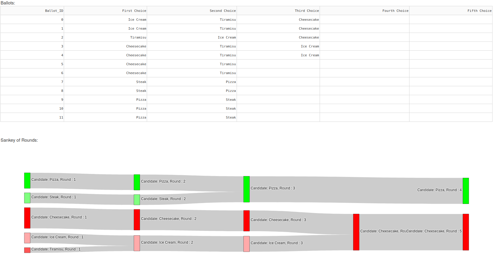

# RCV_Interactive

Very basic Dash app allowing users to put together a Ranked Choice Voting election. Results are displayed in a Sankey diagram. 

Users input a list of candidates, each belonging to a certain party. With these candidates, they create a set of ballots ranking 
candidates by their preference, excluding ones they absolutely do not want to vote for. 

TODO: 
- Allocate ballots to a "lost" candidate when they run out of choices. 
    - Deals with problem of final elimination being in wrong spot, since "lost" ballots are all the way at end
- Change ballot input to being part of the table
- Change candidate input/presentation to tiles
